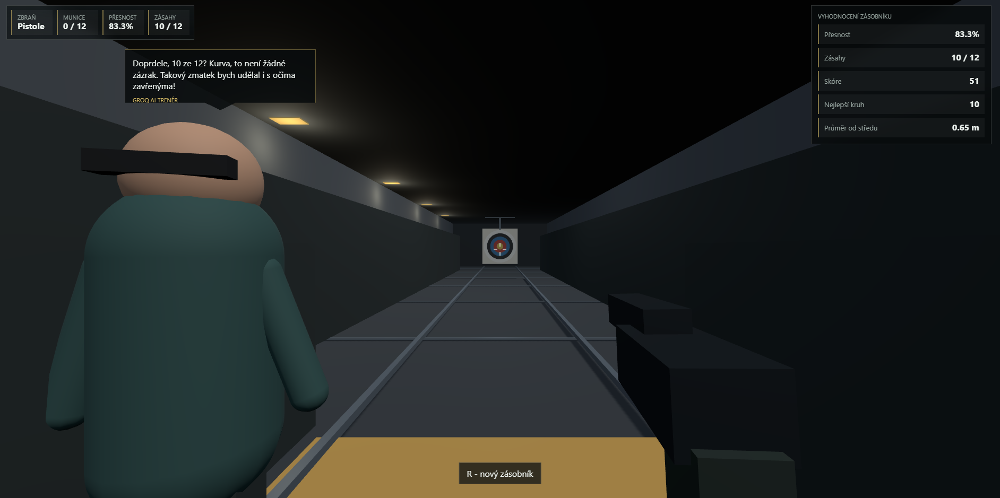
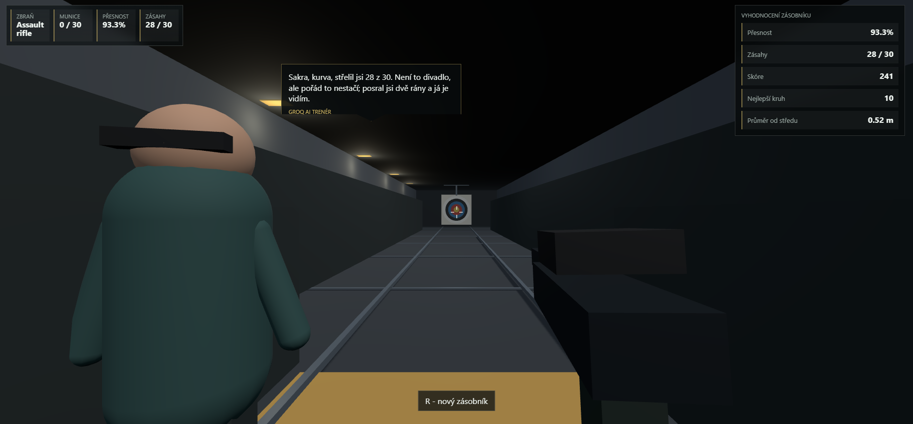

# AI Hit

AI Hit je 3D first-person střelnice v prohlížeči postavená ve Vite, TypeScriptu, Three.js a Expressu. Je to portfolio ukázka, že do hry jde zapojit reálná AI: po vystřílení zásobníku server pošle statistiky do Groq API a NPC instruktor vygeneruje vlastní komentář k výkonu.

## Screenshots





## Co hra umí

- Plně 3D first-person střelnice přímo v browseru.
- Dvě zbraně: pistole a assault rifle.
- Zásobníkový herní loop: vystřílíš munici, terč přijede zpět a hra vyhodnotí výkon.
- Raycast střelba do terče, zásahy podle kruhů, přesnost, nejlepší kruh, skóre a průměrná vzdálenost od středu.
- Procedurální 3D scéna bez externích assetů: střelecký box, kolejnice, terč, NPC instruktor, modely zbraní, muzzle flash a díry po kulkách.
- NPC komentáře v bublině nad instruktorem ve stylu her jako Cyberpunk nebo Witcher.
- AI instruktor přes Groq API: komentář se generuje podle skutečných statistik kola.
- Lokální fallback, takže hra funguje i bez API klíče nebo při chybě API.
- Bezpečný backend proxy endpoint, takže API klíč není ve frontendu.

## AI integrace

Frontend nikdy nedostane Groq API klíč. Hra volá pouze lokální endpoint:

```text
POST /api/npc-commentary
```

Server pošle do Groq API jen výkon hráče:

```json
{
  "weapon": "pistol",
  "shots": 12,
  "hits": 8,
  "accuracy": 66.7,
  "avgDistance": 0.42,
  "bestRing": 9,
  "durationMs": 5300
}
```

Groq vrátí krátký komentář pro NPC bublinu. Instruktor je schválně sprostý, sarkastický a roastí hráče i při dobrém výkonu, aby bylo jasné, že text není pevně napsaný, ale generovaný podle situace.

## Proč je to zajímavé

Tohle není jen statická ukázka Three.js. Hra kombinuje:

- 3D first-person ovládání
- herní scoring
- procedurální scénu
- backend API proxy
- AI generování textu
- bezpečné zacházení s API klíčem

Jinými slovy: umím udělat hratelný browser game prototype a napojit do něj AI tak, aby byla součástí herního loopu, ne jen nalepený chatbot vedle hry.

## Spuštění

```powershell
npm install
npm run dev
```

Otevři:

```text
http://127.0.0.1:5173
```

## Groq API klíč

Nevkládej API klíč do frontendu, `.env.example` ani do GitHub repozitáře. Vytvoř lokální `.env`:

```env
GROQ_API_KEY=tvuj_novy_groq_klic
GROQ_MODEL=llama-3.1-8b-instant
PORT=5173
```

`.env` je v `.gitignore`, takže se nemá commitovat.

## Ovládání

- Myš: míření
- Levé tlačítko: střelba
- `WASD`: pohyb ve střeleckém boxu
- `1`: pistole
- `2`: assault rifle
- `R`: nový zásobník

## Skripty

```powershell
npm run dev
npm run typecheck
npm test
npm run build
npm audit
```

## Tech stack

- TypeScript
- Vite
- Three.js
- Express
- Groq OpenAI-compatible API
- Vitest

## GitHub poznámka

Před pushnutím zkontroluj, že v repozitáři není `.env` ani žádný API klíč:

```powershell
git status --short
git grep "GROQ_API_KEY="
```
